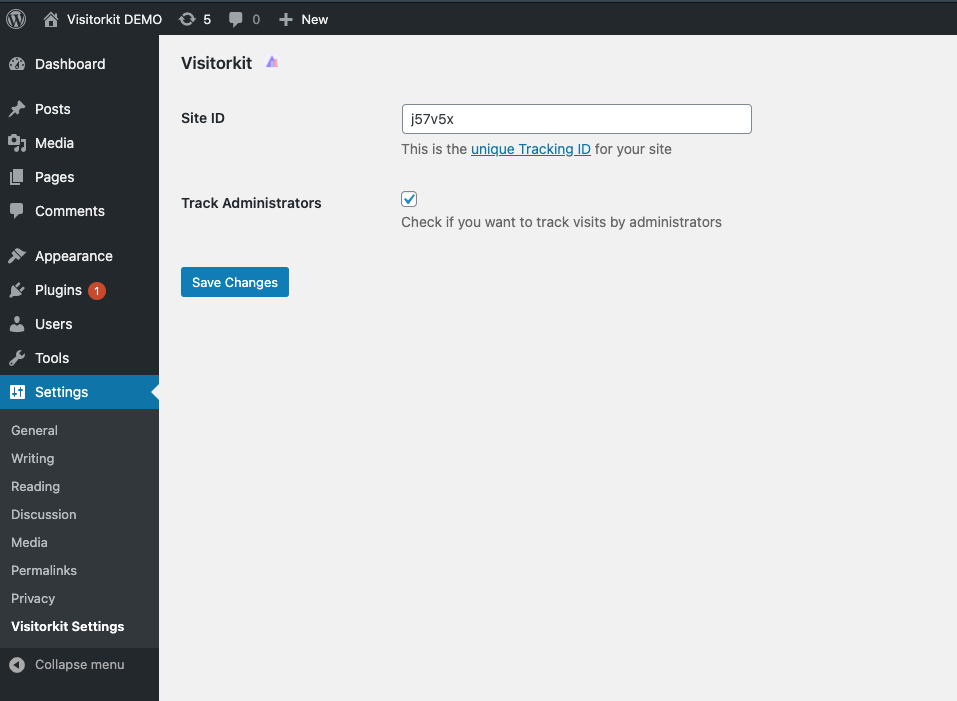

# Visitorkit for WordPress

[Visitorkit](https://visitorkit.com) for WordPress is a simple way add your tracking code to your WordPress site without editing any code. This plugin is for customers of Visitorkit.

### What is Visitorkit?

Visitorkit is a marketing analytics platform that breaks the mold by focusing on conversion tracking and marketing campaign monitoring. The perfect tool to compliment all advertising platforms, social media, and content strategies. Visitorkit shows you where your conversions are coming from so that you can spend more time on marketing that works, and stop wasting money on poorly converting traffic.

SaaS companies use Visitorkit to understand their marketing campaigns, get advanced signals on customer behavior, and build products that convert.

### Usage

Log into Wordpress

1. [Download the Visitorkit plugin](https://github)
2. Go to `Plugins`, `Add New`
3. Upload this plugin, `visitorkit-wp.zip`
4. Click `Install Now`, then `Activate`
5. Go to `Settings`, then `Visitorkit Settings`
6. Type in your `SITE-ID`. If you don’t know your `SITE-ID`, log into [Visitorkit](https://app.visitorkit.com)
